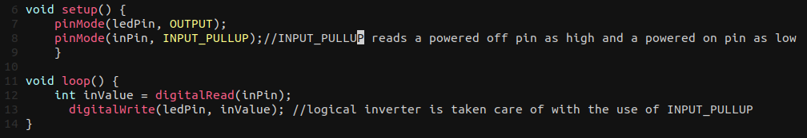
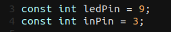
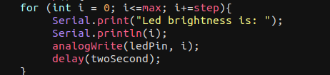
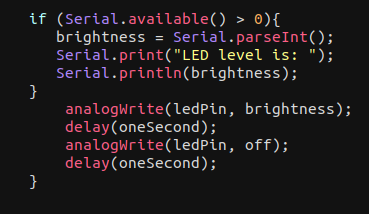

## Lab 1 Report

Jason Klimock, 26322298

## Submitted in Partial Fulfillment of the SOEN 422 Lab Component

sept. 20, 2021

### Abbreviations and acronyms:

LED: Light emitting diode\
PWM: Power width modulation\

## Physical resources used to complete the lab:

- Arduino nano\
- breadboard\
- LED array\
- Bussed Resistor\
- Jumper wires\
- USB A to USB mini B cable\

## Software resources used to complete the lab:
- Arduino IDE

## Reference Code Common 
-  All the code that was used is part of the Arduino standard library.

## Task 1: Logical inverter:
Task 1 was to create a logic inverter where a input pin when set to low (off) would be interpreted by the onboard LED (pin 13) as High (digital on). This inversion is handled by setting the pinMode for the input pin to INPUT_PULLUP, which reads a powered off pin as high. This can be seen on line 8 of the following code.\

To power on the onboard LED this values is read and passed to digitalWrite. In order for this to function on the bread board we need a jumper wire from the ground pin to the + column and then run a jumper wire from pin 9 to the ground column. Plugging in the wire to 9 will turn off the LED and unplugging it will turn on the LED.

## Task 2 Switch to turn LED off and on:
Task 2 was very similar to task 1. The main exception being that instead of using the inbuilt LED, we use any LED from one of the LED arrays on the bread board. For my sketch I used pin 9 as the LED pin and pin 3 as the input pin, as the below code snippet shows. The main code is otherwise the same as task 1. \

For wiring the bread board, we run a jumper wire from the ground pin to the + column. Then a wire from pin 3 to the LED array, side opposite the resister. In the same row as the LED we run a wire from the resister side to the + column (which is ground). A wire is then run from pin 3 to the + column. Unplugging wire to pin 3 turns on the LED to pin 9 and plug it in turns it off.

## Task 3: Cycle through LED brightness with PWM
Task 3 was to write a sketch that could cycle through 4 LED brightness levels. The key to this task it to use a pin that is capable of PWM using analogWrite. On the Nano this means we need to use pin: 3,5,6,9,10, or 11 otherwise the LED will just blink one and off. Using PWM the brightness of an LED can take a value in the range 0-255, instead of just LOW or HIGH. I create a for loop with a step of 64 to give four brightness settings, as seen in the following snippet.\ 

The wiring for this task is straight forward. We first create a ground column in the same fashion as the first two tasks. The we connect a wire from pin 10 to an led (side opposite the resister) and a wire from the resister side of the LED to the ground column. 

## Task 4: LED PWN cycle with serial output:
Task 4 is the same as task 3, except that the LED brightness levels need to be displayed on the arduino IDE serial monitor. The wiring is the same as well. To 
s we need to begin open a serial connection and set the baud rate (bits transferred per second) to match that of the serial monitor, in this case I used the default 9600. Serial can now print as needed to the serial monitor, similar to printing to terminal.\

## Task 5: Adjust brightness of blinking LED through serial monitor input: 
Task 5 is to make a blinking LED vary its brightness based on serial input data. I used the same wiring as task 3 and 4, and we also need to use PWM compatible pins. In order to receive serial input the program checks for bytes from serial, if greater than 0 they will be read. In this sketched I used parseInt(), so that any value from 0-255 may be used for the LED brightness. One consideration, is that the arduino serial monitor must be set to 'no line ending', otherwise a tailing 0 will be received as another input and will over ride the desired brightness value.\

## Conclusion:

These task have illustrated a few important aspects of programming an Arduino. First, it is important to have a connection to ground in order to compete a circuit. Second, It is important to be able to read and understand pinout diagram because not all pins have the same capabilities. In this lab we needed to use PWM, and only certain pins are capable of this. Finally, it is important to be aware of the form that serial input might take, because unexpected character added to input can cause unexpected behavior of a program. 

